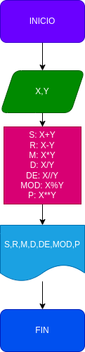

# operaciones aritmeticas
un programa para calcular la suma, resta, multiplicacion, division, division entera, modulo y potencia de dos numeros
## calcular mediante 2 numeros enteros varias operaciones aritmeticas

# analisis

variable de entrada

X y Y : 2 numeros de naturales ingresados para sacarles sus operaciones aritmeticas respectivas

variables de salida

s=x+y
r=x-y
m=x*y
d=x/y
de=x//y
mod=x%y
p=x**y

# diseño

